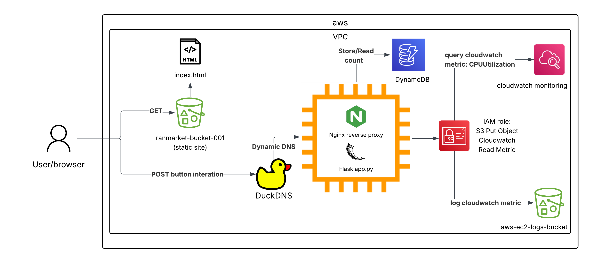

# Simple Static Site with EC2 Logging (AWS Free Tier Project)

This project demonstrates a beginner-friendly AWS architecture using only **Free Tier services**.  
It combines a static frontend hosted on **Amazon S3** with a **Flask backend on EC2**, logs CPU utilization metrics to another S3 bucket, and integrates with **DuckDNS** + **Nginx** for dynamic backend access.

**Live Demo (Frontend):**  
http://ranmarket-bucket-001.s3-website.eu-west-2.amazonaws.com/  

**Backend Domain (DuckDNS):**  
http://ranmarket.duckdns.org  

---

## Features

- **Static Hosting with S3** – Frontend served directly from an S3 bucket.  
- **Dynamic Backend (Flask on EC2)** – Handles interactive requests from frontend buttons.
- **Persistent Storage with DynamoDB** – EC2 now remembers Ranmapoints (RMP) across restarts, crashes, or updates, ensuring state is never lost.
- **CloudWatch + Logging** – EC2 queries CloudWatch for its own CPU metrics and pushes results to a dedicated S3 log bucket.  
- **Automation** – Systemd services ensure scripts and apps run automatically on reboot.  
- **Domain Management** – DuckDNS keeps the backend domain in sync with EC2’s changing IP.  
- **Reverse Proxy with Nginx** – Flask served via port 80 with proper CORS handling.  
- **Cost-Optimized** – 100% within AWS Free Tier.  

---

## Architecture Overview

- **Frontend:** `Ranmarket-Bucket-001` → Static website.  
- **Backend (Compute):** `medium-project1-logger` → EC2 instance running Flask app.  
- **Logging:** `aws-ec2-logs-bucket-1721a5abc6a5643798dee863f844d744d` → Stores CPU utilization logs.
- **Persistence:** DynamoDB table → Stores RMP counts and optionally historical actions.  
- **IAM:** EC2 instance role with S3 access → enables automated logging.  
- **Networking:** DuckDNS subdomain + Nginx reverse proxy → stable backend endpoint.  
- **Region:** eu-west-2 (London).  

---

---

## Getting Started

### Prerequisites
- AWS Free Tier account
- AWS CLI & boto3 configured locally
- SSH access to EC2
- DuckDNS account (for backend domain)

### Setup (High-Level)
1. **Create Resources:**  
   - Two S3 buckets (frontend + logs).  
   - EC2 instance with IAM role (S3 permissions).  
   - Security groups for ports 22, 80.  

2. **Deploy Frontend:**  
   - Upload `index.html` to S3 bucket.  
   - Set correct content-type metadata.  

3. **Deploy Backend:**  
   - Upload `app.py` to EC2.  
   - Configure Flask + systemd service.  
   - Install & configure Nginx as reverse proxy.  

4. **Logging Setup:**  
   - EC2 queries CloudWatch metrics via boto3.  
   - Logs pushed to S3 automatically at boot via systemd.  

5. **Domain Integration:**  
   - Register subdomain with DuckDNS.  
   - Add systemd job to update DuckDNS with current IP.  

---

## Roadmap

- Store Ranmapoints (RMP) count in **DynamoDB** for persistence.  
- Add **Lambda** automation for EC2 start/stop on schedule.  
- Improve UI with animations, interaction history, and styling.  

---

## Project Log / Development Story

The sections below are the **detailed narrative** of how the project was built — challenges, fixes, reflections.  
It’s long, but it captures the real journey from zero → working architecture.

## Phase 1: Planning & Architecture

Before touching AWS, I sketched out a rough architecture on Lucidchart. The goal was simple: a minimal, fully automated website + logging setup that I could control without clicking around in the AWS console.

**Frontend:** `Ranmarket-Bucket-001` → serves the static website.  
**Backend Metrics:** `aws-ec2-logs-bucket-1721a5abc6a5643798dee863f844d744d` → stores CPUUtilization metrics from the EC2 instance.  
**Compute:** `medium-project1-logger` → EC2 instance that queries CloudWatch for its own CPU metrics and pushes them to the logs bucket.  
**Glue:** IAM Role with full S3 access assigned to the EC2 instance, so it can write logs automatically.  

All resources were provisioned in `eu-west-2 (London)` to keep everything consistent.

---

## Phase 2: Infrastructure Buildout

Since I wanted to learn automation and avoid the console, I relied heavily on **boto3** and the **AWS CLI**. This stage was mostly about creating the building blocks, even if they weren’t wired together yet.

**Key progress made:**

- Created the two S3 buckets (static content + logs).  
- Spun up the EC2 instance (`medium-project1-logger`) with its key pair (`London-Ranmakey.pem`) and security group.  
- Assigned an IAM Role with full S3 access to the EC2 instance.  
- Prepared CloudWatch query code (ready to run on EC2).  

At this point, all pieces exist, but the system isn’t connected. For example, the EC2 instance isn’t yet running the query to push logs to S3.

**Note:** The “setup commands” folder contains all the boto3 and CLI snippets I experimented with. They are floating around in no particular order, but that is because I had no particular order in writing the code. Eventually, I learned what the optimal raw infrastructure setup process would be.

**Reflections:**  
Even though I hit syntax errors and small blockers along the way, this phase gave me confidence: I could see how AWS pieces fit together and automate almost everything. It’s a small win, but it’s exciting to see tangible infrastructure appear purely from code.

---

## Phase 3: Connecting the Dots

Once the building blocks were ready, the next step was getting everything to talk to each other.

### SSH & Environment Setup
- Practiced logging into the EC2 instance (`medium-project1-logger`) via SSH.  
- Updated Python and pip to the latest recommended versions.  
- Installed all required packages for CloudWatch queries and S3 interaction.  

### Systemd Integration
- Learned how to create a custom systemd service to run scripts automatically at boot.  
- Created `boto3-boot-query.service` and uploaded it along with the CloudWatch query Python script.  
- Used `sudo systemctl enable/start/restart` to make sure our service ran reliably on boot.  

### Debugging Logs & S3 Integration
- Initially, logs were being generated locally on the EC2 instance instead of being sent to the S3 bucket.  
- After some trial and error (fixing a mix of Python syntax, permissions, and S3 bucket path issues), the problem was resolved.  
- **Result:** a single CPU metric log was successfully sent from the EC2 instance to the S3 bucket every time the machine booted.  

### Final Wiring
- EC2 instance now writes to `aws-ec2-logs-bucket-1721a5abc6a5643798dee863f844d744d`.  
- S3 bucket `Ranmarket-Bucket-001` serves the static website.  
- IAM roles, CloudWatch, EC2, and S3 were all part of a single “project” with automated logging working reliably.  

**Reflection:**  
This phase was all about hands-on troubleshooting. Even though some fixes were forgotten in the fog of trial-and-error, the process solidified my understanding of AWS services interacting in concert:  
**EC2 → CloudWatch → S3 via IAM permissions**, all automated through systemd.

---

## Phase 4: Building the Web App

With the backend infrastructure in place, it was time to make the project **interactive and visible to users**.

### Stepping Out of Python Comfort Zone
- Quickly realized that full cloud automation wasn’t enough: we needed **JavaScript and HTML** for the frontend.  
- Spent a few hours learning the basics and building a mini, locally hosted, “Alice in Cyberland” style web app to practice DOM manipulation and event handling.  

### Frontend Development
- Learned JavaScript `eventListeners` to react to user interactions.  
- Started connecting code to Flask endpoints and used CSS to begin designing the actual Ranmarket web interface.  
- Created a **basic `index.html`** with an intro paragraph and two buttons (+1 RMP, -1 RMP).  

### Deploying Static Content to S3
- Uploaded `index.html` to `Ranmarket-Bucket-001`.  
- Hit a minor snag: the object’s content type was not set correctly, causing the browser to download the file instead of displaying it.  
- After fixing the content type, the page rendered perfectly in the browser.  

### Flask Integration
- Built a minimal `app.py` to handle the button POST requests.  
- At this stage, the frontend looked polished but the backend wasn’t yet responding to button clicks.  

### Frontend Polishing
- Uploaded a pixelated market JPEG to the S3 bucket for background.  
- Tweaked CSS and paths until the page looked presentable.  

### Wiring Backend to Frontend
- SCP’d `app.py` to the EC2 instance (kept it simple, no folders — only a handful of files).  
- Initial attempts to run the site failed — the buttons did nothing.  
- This set the stage for **Phase 5**, which would be an extended debugging and upgrade session to finally get the site responsive.  

**Reflection:**  
Phase 4 was a mix of **learning new languages, designing a UI, and basic deployment**. It was humbling, frustrating, but crucial — without experimenting in JavaScript and HTML, the buttons would never have responded.

---

## Phase 5: Debugging & Domain Setup

At this point, we had two decent pieces:  
- The **static site** (looking neat on S3).  
- The **Flask backend** (running on EC2).  

But wiring them together properly was a whole new journey.

### Automating the Backend with systemd
- Uploading `app.py` to the instance was straightforward, but turning it on every reboot wasn’t.  
- Solved by creating a **systemd service** (based on our earlier template) to automatically run `app.py` on startup.  
- After enabling the service, the Flask app now started automatically whenever the EC2 instance booted.  

### Dynamic IP Problem → DuckDNS
- First roadblock: EC2’s **public IP changes** on every restart.  
- Hardcoding IPs into `index.html` was not sustainable.  
- Elastic IP was an option, but **not Free Tier friendly**.  
- Enter **DuckDNS**:  
  - Signed in with GitHub.  
  - Got a free subdomain: `ranmarket.duckdns.org`.  
  - Updated `index.html` JavaScript to POST to `http://ranmarket.duckdns.org`.  

### Automating DuckDNS Updates
- DuckDNS still needed to know the EC2’s new IP each reboot.  
- Solution: another **systemd service** to update DuckDNS with the current IP at boot.  
- With this, the domain always stayed synced with the instance’s live IP.  

### Moving to Port 80 with Nginx
- Next issue: Flask was still serving on port **5000**, while most sites run on **port 80**.  
- Decided to configure **Nginx** as a reverse proxy (industry standard and simpler than expected).  

### Security Group Fixes
- Adjusted EC2 security group rules:  
  - **Port 22 (SSH):** restricted to my IP.  
  - **Port 5000:** left open to `0.0.0.0/0` (for dev/debugging).  
  - **Port 80:** open to `0.0.0.0/0` (so the web app could serve properly).  

### Verifying the Setup
- With Nginx configured, tested via `curl -X POST` to the Flask endpoint.  
- Success — the counter incremented correctly.  

### The Final Boss: CORS
- Returning to the website, everything still looked dead.  
- After debugging, realized the culprit: **CORS (Cross-Origin Resource Sharing)**.  
- Frontend requests from `ranmarket-bucket-001.s3-website.eu-west-2.amazonaws.com` to `ranmarket.duckdns.org` were being blocked by browsers.  
- This set the stage for the final push: configuring CORS properly to allow frontend–backend communication.  

**Reflection:**  
Phase 5 tied everything together: **systemd, DuckDNS, Nginx, and security groups**. It was the most challenging step so far, requiring both infrastructure and networking fixes. The journey was long, but each obstacle taught something new about how real-world cloud apps stay reliable and accessible.
---

## Phase 5.5: Procrastination, QoL Upgrades & The CORS Finale

Before diving into the dreaded **CORS debugging**, I procrastinated a little. But as it turns out, that procrastination turned into two **quality-of-life upgrades** that actually helped me get motivated again.  

###  Bucket Lifecycle Rule (Log Cleanup)
- Realized the **logs S3 bucket** would be spammed every time the EC2 instance was on.  
- Solution: added a **lifecycle rule** to auto-delete logs older than **7 days**.  
- Why not Glacier or Deep Archive? Because free tier storage is limited (5GB), and I don’t really care about old logs unless they were catastrophic (which I’d notice within a week anyway).  
- Result: the logs bucket now **manages itself**, never filling up endlessly.  

### boto3-smart-start-ec2.py
- Wrote a Python helper script to automate starting my EC2 instances:  
  - Lists instances by **tags**.  
  - Starts them if they’re stopped.  
  - Waits for a public IP to appear (with a fun countdown).  
  - Prints a **ready-to-use SSH command** for immediate access.  
- No more typing out long commands or checking the AWS console manually — all at the click of a button.  

These two upgrades were small but powerful. With the bucket under control and instance startup smoother, I had no more excuses. It was time to face **CORS**.

---

### Breaking Into CORS
This phase was messy, long, and stressful, but here’s the condensed story:  

1. Added `CORS(app)` directly to `app.py`.  
   - Didn’t work.  
2. Configured **CORS headers in Nginx** instead (read it was more reliable).  
   - Still only worked with `curl`, not the frontend.  
3. Cleaned up **security groups**:  
   - Removed `0.0.0.0/0` on port 5000 (since Nginx was now the only entry point).  
4. Rebooted the instance and tested again.  
   - Still broken.  
   - Realized **Nginx wasn’t even running** .  
5. Called on **systemd** once again:  
   - Set `Restart=always` so Nginx would auto-run on boot.  
   - Now the backend always came online with the instance.  
6. Tried the site again… still nothing.  
   - Pressed **F12** (developer tools).  
   - Saw it was *still* CORS.  

---

### The Final Twist
- The problem? Both **Flask** and **Nginx** were trying to handle CORS at the same time.  
- This double-handling confused everything.  
- Solution: **removed CORS from app.py**, left it only in **Nginx config**.  
- Tried again… and **IT FINALLY WORKED.**  

---

**Reflection:**  
Phase 5.5 was the emotional rollercoaster: small detours that turned into powerful improvements, followed by the **final showdown with CORS**. In the end, the lesson was clear:  
- Automate what you can (lifecycle rules, startup scripts).  
- Use **systemd** as your safety net.  
- And when in doubt… **check Nginx first.**

 The buttons on the site finally responded.  
 Static frontend and dynamic backend fully integrated.  
 Project complete. *BOWS* (of course not, we've still got dynamodb!)

---

## Phase 6: DynamoDB persistence
This phase was much easier than expected. The only thing I came accross was that I forgot the IAM policy for DynamoDB access for the instance. But once that was outta the way, all we needed was to update the flask and html to get the current points on page load/refresh, and the increment/decrement to actually update the value on the table in DynamoDB. Smooth Sailing.

Now, the project is finally done. not bad for a first real Github project huh?
