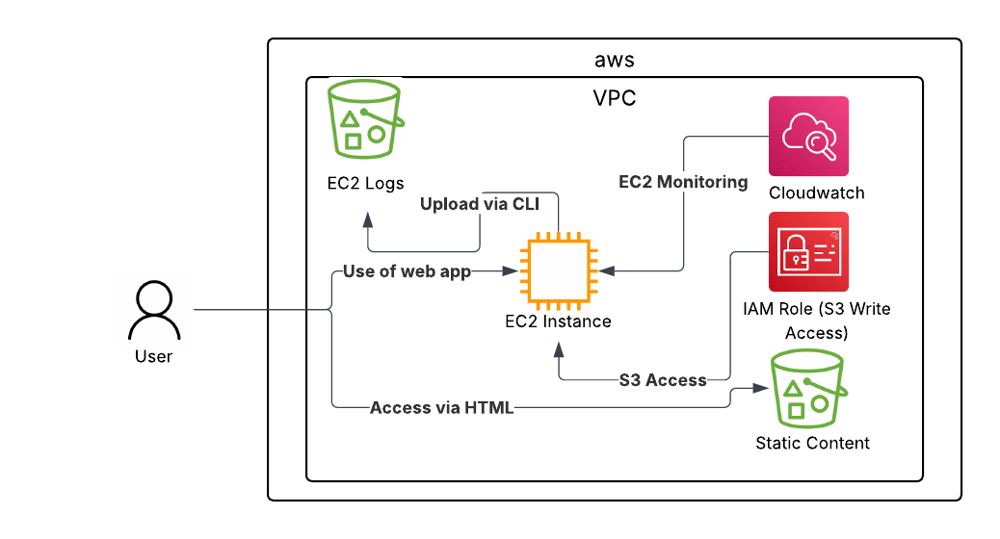

# Simple Static Site with EC2 Logging (AWS Free Tier Project)

This project demonstrates a beginner-friendly AWS architecture using only **Free Tier services**.  
It combines a static frontend hosted on **Amazon S3** with a **Flask backend on EC2**, logs CPU utilization metrics to another S3 bucket, and integrates with **DuckDNS** + **Nginx** for dynamic backend access.

🔗 **Live Demo (Frontend):**  
http://ranmarket-bucket-001.s3-website.eu-west-2.amazonaws.com/  

🔗 **Backend Domain (DuckDNS):**  
http://ranmarket.duckdns.org  

---

## 📌 Features

- **Static Hosting with S3** – Frontend served directly from an S3 bucket.  
- **Dynamic Backend (Flask on EC2)** – Handles interactive requests from frontend buttons.  
- **CloudWatch + Logging** – EC2 queries CloudWatch for its own CPU metrics and pushes results to a dedicated S3 log bucket.  
- **Automation** – Systemd services ensure scripts and apps run automatically on reboot.  
- **Domain Management** – DuckDNS keeps the backend domain in sync with EC2’s changing IP.  
- **Reverse Proxy with Nginx** – Flask served via port 80 with proper CORS handling.  
- **Cost-Optimized** – 100% within AWS Free Tier.  

---

## 🏗️ Architecture Overview

- **Frontend:** `Ranmarket-Bucket-001` → Static website.  
- **Backend (Compute):** `medium-project1-logger` → EC2 instance running Flask app.  
- **Logging:** `aws-ec2-logs-bucket-1721a5abc6a5643798dee863f844d744d` → Stores CPU utilization logs.  
- **IAM:** EC2 instance role with S3 access → enables automated logging.  
- **Networking:** DuckDNS subdomain + Nginx reverse proxy → stable backend endpoint.  
- **Region:** eu-west-2 (London).  

---

---

## 🚀 Getting Started

### Prerequisites
- AWS Free Tier account
- AWS CLI & boto3 configured locally
- SSH access to EC2
- DuckDNS account (for backend domain)

### Setup (High-Level)
1. **Create Resources:**  
   - Two S3 buckets (frontend + logs).  
   - EC2 instance with IAM role (S3 permissions).  
   - Security groups for ports 22, 80.  

2. **Deploy Frontend:**  
   - Upload `index.html` to S3 bucket.  
   - Set correct content-type metadata.  

3. **Deploy Backend:**  
   - Upload `app.py` to EC2.  
   - Configure Flask + systemd service.  
   - Install & configure Nginx as reverse proxy.  

4. **Logging Setup:**  
   - EC2 queries CloudWatch metrics via boto3.  
   - Logs pushed to S3 automatically at boot via systemd.  

5. **Domain Integration:**  
   - Register subdomain with DuckDNS.  
   - Add systemd job to update DuckDNS with current IP.  

---

## 🔮 Roadmap

- [ ] Store Ranmapoints (RMP) count in **DynamoDB** for persistence.  
- [ ] Add **Lambda** automation for EC2 start/stop on schedule.  
- [ ] Improve UI with animations, interaction history, and styling.  

---

## 📖 Project Log / Development Story

The sections below are the **detailed narrative** of how the project was built — challenges, fixes, reflections.  
It’s long, but it captures the real journey from zero → working architecture.

### Phase 1: Planning & Architecture
*(your text here unchanged)*

### Phase 2: Infrastructure Buildout
*(your text here unchanged)*

### Phase 3: Connecting the Dots
*(your text here unchanged)*

### Phase 4: Building the Web App
*(your text here unchanged)*

### Phase 5: Debugging & Domain Setup
*(your text here unchanged)*

### Phase 5.5: Procrastination, QoL Upgrades & The CORS Finale
*(your text here unchanged)*

### Phase 6: Breaking Into CORS
*(your text here unchanged)*

---

## ✨ Reflection v2

Of course this project isn’t done. Not even close. Core stack is breathing:

- S3 serving static like it should.  
- EC2 logging in, reporting back clean.  
- Buttons clicking, backend reacting.  
- Fully free-tier, costs optimized.  

But project isn’t finished — it’s just working.  
Next on deck:  

- EC2 memory for RMP count via DynamoDB (persistence unlocked).  
- Lambda for EC2 start/stop on schedule (efficiency unlocked).  
- UI overhaul: motion, interaction, history feed (style unlocked).  

This isn’t the final form. It’s beating the mid-boss.  
Phase 7 will start bending this from “toy demo” into “system with teeth.”  
